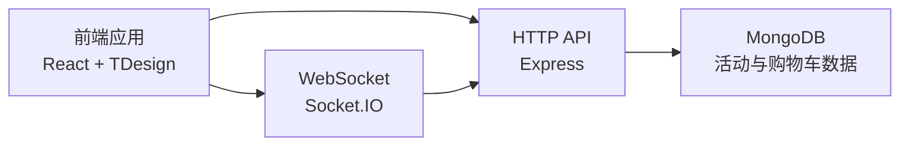

# 娇兰日化购物平台

一个基于 React + TDesign + Node.js + Socket.IO + MongoDB 的前后端一体化电商项目，聚焦“高质感前端体验 + 实时数据同步”。

## 项目亮点

- 高完成度前端界面：首页、商品列表、购物车、结算页、管理监控页完整闭环
- 组件化与状态管理：基于 React 组件拆分 + `CartContext` 统一购物车状态
- 实时协同能力：通过 Socket.IO 实时广播用户活动与购物车更新
- 多端可用体验：响应式布局，适配桌面端与移动端
- 工程化交付：提供 Docker、批处理/脚本化部署方案，便于快速上线

## 核心功能

- 商品浏览、筛选、排序、分页展示
- 购物车增删改、数量同步、价格实时计算
- 用户行为埋点（浏览、加购、结算等）
- 管理端实时活动监控（活动流、连接状态、统计信息）

## 技术架构

### 前端

- React 18 + TypeScript
- Vite 5 构建
- TDesign React 组件库
- Tailwind CSS 辅助样式

### 后端

- Node.js + Express
- Socket.IO 实时通信
- MongoDB 数据持久化（含内存降级兜底）

### 架构关系



## 目录结构

```text
TEST/
├─ src/                 # 前端源码（页面、组件、状态、服务）
├─ server/              # 后端服务与数据模型
├─ Dockerfile           # 镜像构建
├─ docker-compose.yml   # 多服务编排
├─ DEPLOYMENT.md        # 部署说明
└─ package.json         # 项目脚本与依赖
```

## 快速开始

### 方式一：在项目目录启动（推荐）

```bash
cd D:\TEST\TEST
npm install
npm run dev
```

### 方式二：在上级目录启动（已适配）

```bash
cd D:\TEST
npm run dev
```

### 常用脚本

- `npm run frontend`：启动前端开发服务（默认 `http://localhost:5173`）
- `npm run server`：启动后端服务（默认 `http://localhost:3000`）
- `npm run dev`：并行启动前后端
- `npm run build`：构建前端产物

## 环境变量

请复制 `.env.example` 到 `.env` 并按需修改：

- `PORT`
- `NODE_ENV`
- `MONGODB_URI`
- `CLIENT_URL`
- `DB_NAME`

## 前端能力展示说明

本项目重点体现以下前端能力：

- 业务型页面设计与组件化组织能力
- 数据驱动 UI 与交互状态管理能力
- 实时交互场景（Socket）在页面层的落地能力
- 电商场景下的信息架构与视觉层级把控能力

## 后续更新计划

- 订单创建与支付流程完善
- 登录鉴权与管理端权限控制
- TypeScript 类型收敛与前后端接口约束
- CI/CD 与自动化测试补齐

## 作者

- GitHub: [zhouhaot](https://github.com/zhouhaot)

## 许可证

仅用于学习与交流，后续可按需要补充正式 License。
