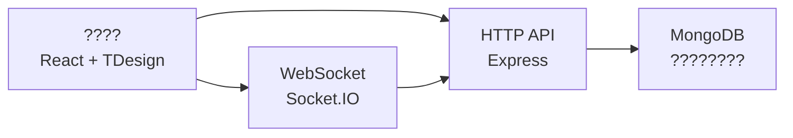

# ????????

???? React + TDesign + Node.js + Socket.IO + MongoDB ?????????????????????? + ????????

## ????

- ??????????????????????????????????
- ??????????? React ???? + `CartContext` ???????
- ????????? Socket.IO ??????????????
- ??????????????????????
- ???????? Docker????/??????????????

## ????

- ???????????????
- ??????????????????
- ?????????????????
- ????????????????????????

## ????

### ??

- React 18 + TypeScript
- Vite 5 ??
- TDesign React ???
- Tailwind CSS ????

### ??

- Node.js + Express
- Socket.IO ????
- MongoDB ??????????????

### ????



## ????

```text
TEST/
?? src/                 # ?????????????????
?? server/              # ?????????
?? Dockerfile           # ????
?? docker-compose.yml   # ?????
?? DEPLOYMENT.md        # ????
?? package.json         # ???????
```

## ????

### ???????????????

```bash
cd D:\TEST\TEST
npm install
npm run dev
```

### ????????????????

```bash
cd D:\TEST
npm run dev
```

### ????

- `npm run frontend`???????????? `http://localhost:5173`?
- `npm run server`?????????? `http://localhost:3000`?
- `npm run dev`????????
- `npm run build`???????

## ????

??? `.env.example` ? `.env` ??????

- `PORT`
- `NODE_ENV`
- `MONGODB_URI`
- `CLIENT_URL`
- `DB_NAME`

## ????????

??????????????

- ???????????????
- ???? UI ?????????
- ???????Socket??????????
- ???????????????????

## ??????

- ???????????
- ????????????
- TypeScript ????????????
- CI/CD ????????

## ???

??????????????????? License?
