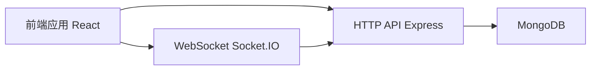

# 娇兰日化购物平台

这是一个基于 React、Node.js、Socket.IO、MongoDB 的前后端一体化电商项目，重点展示前端页面设计、组件化能力和实时交互能力。

## 项目亮点

- 首页、商品列表、购物车、结算页、管理监控页完整闭环
- React 组件化拆分，使用 Context 管理购物车状态
- 基于 Socket.IO 实现用户活动和购物车实时同步
- 响应式布局，兼容桌面端和移动端
- 提供 Docker 与脚本化部署能力

## 核心功能

- 商品浏览、筛选、排序、分页
- 购物车增删改与金额实时计算
- 用户行为记录与实时活动流展示
- 管理页实时查看系统活动与连接状态

## 技术栈

### 前端

- React 18
- TypeScript
- Vite 5
- TDesign React
- Tailwind CSS

### 后端

- Node.js
- Express
- Socket.IO
- MongoDB

## 架构关系



## 目录结构

```text
TEST/
├─ src/                 # 前端源码
├─ server/              # 后端源码
├─ Dockerfile
├─ docker-compose.yml
├─ DEPLOYMENT.md
└─ package.json
```

## 快速开始

### 在项目目录启动

```bash
cd D:\TEST\TEST
npm install
npm run dev
```

### 在上级目录启动

```bash
cd D:\TEST
npm run dev
```

## 常用命令

- `npm run frontend` 启动前端开发服务（默认 http://localhost:5173）
- `npm run server` 启动后端服务（默认 http://localhost:3000）
- `npm run dev` 并行启动前后端
- `npm run build` 构建前端

## 环境变量

复制 `.env.example` 为 `.env` 后按需修改：

- `PORT`
- `NODE_ENV`
- `MONGODB_URI`
- `CLIENT_URL`
- `DB_NAME`

## 前端能力展示

- 页面布局与信息层级设计能力
- 组件化开发与可维护性能力
- 数据驱动 UI 与状态管理能力
- 实时交互场景落地能力

## 后续更新计划

- 完善订单创建与支付流程
- 增加登录鉴权与管理端权限控制
- 强化 TypeScript 类型约束
- 补齐自动化测试与 CI/CD

## 许可证

仅用于学习与交流，后续可按需要补充正式 License。