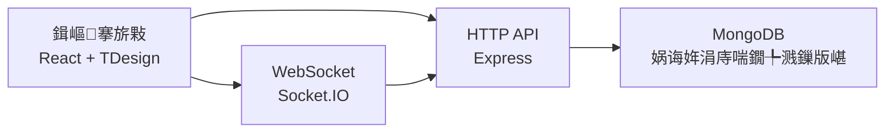

# 濞囧叞鏃ュ寲璐墿骞冲彴

涓€涓熀浜?React + TDesign + Node.js + Socket.IO + MongoDB 鐨勫墠鍚庣涓€浣撳寲鐢靛晢椤圭洰锛岃仛鐒︹€滈珮璐ㄦ劅鍓嶇浣撻獙 + 瀹炴椂鏁版嵁鍚屾鈥濄€?
## 椤圭洰浜偣

- 楂樺畬鎴愬害鍓嶇鐣岄潰锛氶椤点€佸晢鍝佸垪琛ㄣ€佽喘鐗╄溅銆佺粨绠楅〉銆佺鐞嗙洃鎺ч〉瀹屾暣闂幆
- 缁勪欢鍖栦笌鐘舵€佺鐞嗭細鍩轰簬 React 缁勪欢鎷嗗垎 + `CartContext` 缁熶竴璐墿杞︾姸鎬?- 瀹炴椂鍗忓悓鑳藉姏锛氶€氳繃 Socket.IO 瀹炴椂骞挎挱鐢ㄦ埛娲诲姩涓庤喘鐗╄溅鏇存柊
- 澶氱鍙敤浣撻獙锛氬搷搴斿紡甯冨眬锛岄€傞厤妗岄潰绔笌绉诲姩绔?- 宸ョ▼鍖栦氦浠橈細鎻愪緵 Docker銆佹壒澶勭悊/鑴氭湰鍖栭儴缃叉柟妗堬紝渚夸簬蹇€熶笂绾?
## 鏍稿績鍔熻兘

- 鍟嗗搧娴忚銆佺瓫閫夈€佹帓搴忋€佸垎椤靛睍绀?- 璐墿杞﹀鍒犳敼銆佹暟閲忓悓姝ャ€佷环鏍煎疄鏃惰绠?- 鐢ㄦ埛琛屼负鍩嬬偣锛堟祻瑙堛€佸姞璐€佺粨绠楃瓑锛?- 绠＄悊绔疄鏃舵椿鍔ㄧ洃鎺э紙娲诲姩娴併€佽繛鎺ョ姸鎬併€佺粺璁′俊鎭級

## 鎶€鏈灦鏋?
### 鍓嶇

- React 18 + TypeScript
- Vite 5 鏋勫缓
- TDesign React 缁勪欢搴?- Tailwind CSS 杈呭姪鏍峰紡

### 鍚庣

- Node.js + Express
- Socket.IO 瀹炴椂閫氫俊
- MongoDB 鏁版嵁鎸佷箙鍖栵紙鍚唴瀛橀檷绾у厹搴曪級

### 鏋舵瀯鍏崇郴



## 鐩綍缁撴瀯

```text
TEST/
鈹溾攢 src/                 # 鍓嶇婧愮爜锛堥〉闈€佺粍浠躲€佺姸鎬併€佹湇鍔★級
鈹溾攢 server/              # 鍚庣鏈嶅姟涓庢暟鎹ā鍨?鈹溾攢 Dockerfile           # 闀滃儚鏋勫缓
鈹溾攢 docker-compose.yml   # 澶氭湇鍔＄紪鎺?鈹溾攢 DEPLOYMENT.md        # 閮ㄧ讲璇存槑
鈹斺攢 package.json         # 椤圭洰鑴氭湰涓庝緷璧?```

## 蹇€熷紑濮?
### 鏂瑰紡涓€锛氬湪椤圭洰鐩綍鍚姩锛堟帹鑽愶級

```bash
cd D:\TEST\TEST
npm install
npm run dev
```

### 鏂瑰紡浜岋細鍦ㄤ笂绾х洰褰曞惎鍔紙宸查€傞厤锛?
```bash
cd D:\TEST
npm run dev
```

### 甯哥敤鑴氭湰

- `npm run frontend`锛氬惎鍔ㄥ墠绔紑鍙戞湇鍔★紙榛樿 `http://localhost:5173`锛?- `npm run server`锛氬惎鍔ㄥ悗绔湇鍔★紙榛樿 `http://localhost:3000`锛?- `npm run dev`锛氬苟琛屽惎鍔ㄥ墠鍚庣
- `npm run build`锛氭瀯寤哄墠绔骇鐗?
## 鐜鍙橀噺

璇峰鍒?`.env.example` 鍒?`.env` 骞舵寜闇€淇敼锛?
- `PORT`
- `NODE_ENV`
- `MONGODB_URI`
- `CLIENT_URL`
- `DB_NAME`

## 鍓嶇鑳藉姏灞曠ず璇存槑

鏈」鐩噸鐐逛綋鐜颁互涓嬪墠绔兘鍔涳細

- 涓氬姟鍨嬮〉闈㈣璁′笌缁勪欢鍖栫粍缁囪兘鍔?- 鏁版嵁椹卞姩 UI 涓庝氦浜掔姸鎬佺鐞嗚兘鍔?- 瀹炴椂浜や簰鍦烘櫙锛圫ocket锛夊湪椤甸潰灞傜殑钀藉湴鑳藉姏
- 鐢靛晢鍦烘櫙涓嬬殑淇℃伅鏋舵瀯涓庤瑙夊眰绾ф妸鎺ц兘鍔?
## 鍚庣画鏇存柊璁″垝

- 璁㈠崟鍒涘缓涓庢敮浠樻祦绋嬪畬鍠?- 鐧诲綍閴存潈涓庣鐞嗙鏉冮檺鎺у埗
- TypeScript 绫诲瀷鏀舵暃涓庡墠鍚庣鎺ュ彛绾︽潫
- CI/CD 涓庤嚜鍔ㄥ寲娴嬭瘯琛ラ綈

## 璁稿彲璇?
浠呯敤浜庡涔犱笌浜ゆ祦锛屽悗缁彲鎸夐渶瑕佽ˉ鍏呮寮?License銆?
